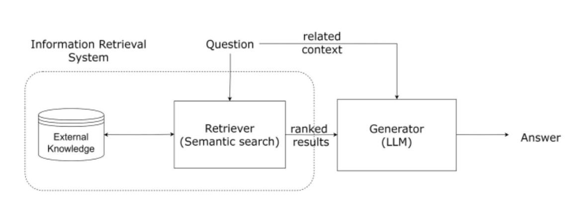

# Semantic Spotter Assignment : Automated System for Extracting, Comparing, and Summarizing Insights from Government Documents

## Problem Statement
Create an automated system to extract, compare, and summarize information from Indian government documents, such as Prime Minister speeches, President speeches, and budget releases. Downloaded data from below specified URLs.:
- https://eparlib.nic.in
- https://sansad.in/ls/knowledge-centre/speeches

The system should be able to:
1. **Information Handling**: Automatically extract text content from Prime Minister speeches, President speeches, and budget releases..

2. **Comparative Analysis**: Examine the retrieved documents to uncover common themes, trends, and distinctions among various types of speeches and reports. This analysis may include sentiment analysis, topic modeling, or other relevant techniques to compare the content.

3. **Summarizing Text**: Condense the extracted information into clear, concise summaries. These summaries should highlight the key points and main ideas from the documents, allowing users to quickly understand the essential content without reading through lengthy texts.

The system should be efficient, accurate, and user-friendly, offering valuable insights into the content of Indian government documents for stakeholders like researchers, policymakers, and the general public.

## Approach to Problem Resolution
***Solution Strategy*** - Develop a proof of concept (POC) that meets the following requirements:
-  Extract key information, identify trends and comparisons, and generate concise summaries.

-  Offer valuable insights for researchers, policymakers, and the public to understand government communication.

***Goal*** - Successfully addressing these two requirements in the POC will ensure the overall model's accuracy is high, making further improvements and customizations worthwhile..

***Data Used*** -  Indian government documents are available as PDFs and are organized into four folders: "Prime Minister Speech", "President Speech", and "Interim Budget".

***Tools used*** - LlamaIndex has been utilized for now because of its powerful query engine, rapid data processing with data loaders and directory readers, and its ease of implementation with fewer lines of code.

## System Design

## Learnings

1. Efficient Document Retrieval: Utilized llamaIndex for rapid data processing and extraction from various government documents.
2. Comparative Analysis Insights: Employed multiple indices to examine and contrast speeches by the Prime Minister and President, committee reports, and budget announcements.
3. Concise Summarization Techniques: Used HuggingFaceEmbeddings and QdrantVectorStore to distill key information into clear summaries.
4. Effective Tool Selection: Selected appropriate tools like SummaryIndex for summarization and VectorStoreIndex for context retrieval.
5. Query Engine Configuration: Set up query engines for summarization and context retrieval to facilitate efficient user interactions.
6. Integration of Multiple Technologies: Combined llamaIndex, HuggingFaceEmbeddings, and QdrantVectorStore for thorough document analysis.
7. Collaborative Development: Worked with various tools and libraries to effectively tackle different aspects of the problem statement.
8. Scalability Considerations: Addressed scalability by considering factors like chunk size and context window for efficient processing of large document volumes.

## Contact
Created by [@badarihp] - feel free to contact me!