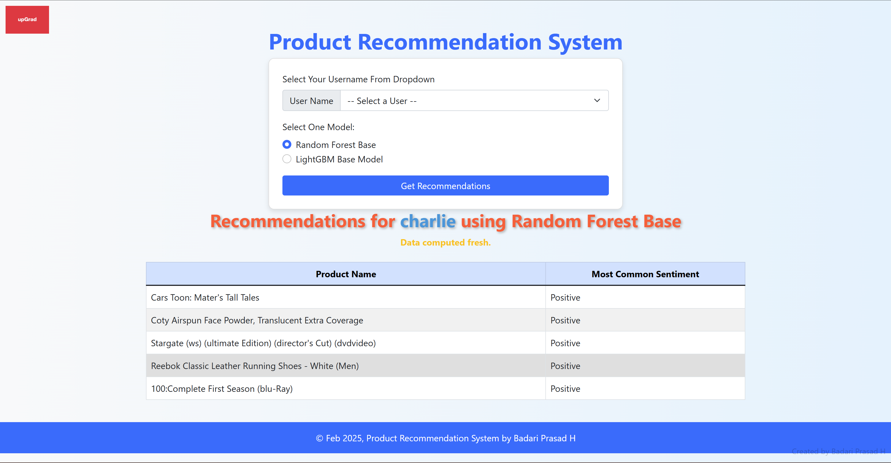
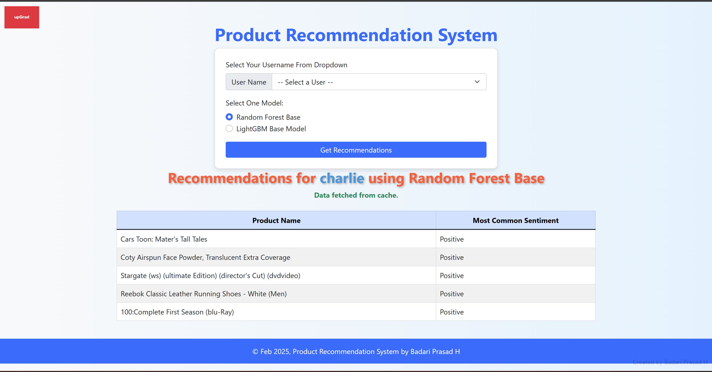

# Sentiment-Based Product Recommendation System

This repository contains a **Sentiment-Based Product Recommendation System**, which combines **Collaborative Filtering** and **Sentiment Analysis** to recommend products based on user preferences and review sentiments. The system includes a **Flask web application** that runs locally for live interaction.

---

## Table of Contents

- [Project Overview](#project-overview)
- [Key Features](#key-features)
- [Technologies Used](#technologies-used)
- [Setup Instructions](#setup-instructions)
- [Model Details](#model-details)
- [Deployment](#deployment)
- [File Structure](#file-structure)
- [How It Works](#how-it-works)
- [Data Flow Diagram](#data-flow-diagram)
- [Screenshots](#screenshots)
- [Future Improvements](#future-improvements)
- [Conclusion](#conclusion)
- [References](#references)
- [Contact](#contact)

---

## Project Overview

E-commerce platforms thrive on personalized recommendations. To stay competitive, this project focuses on improving recommendations by leveraging customer reviews and ratings. It integrates **Sentiment Analysis** with **User-User Collaborative Filtering** to offer highly personalized and relevant product suggestions.

The system allows users to:
- Get product recommendations based on similar users.
- Filter recommendations based on positive sentiment analysis of reviews.

---

## Key Features

1. **User-User Collaborative Filtering**: Recommends products based on similarities in user preferences.
2. **Sentiment Filtering**: Prioritizes products with positive sentiment reviews.
3. **Flask Web Application**: Provides an intuitive interface for users to interact with the recommendation system.
4. **Deployment**: The application can be hosted on locally.
5. **Reusable Models**: Trained models and preprocessing components are stored as pickle files for easy deployment.

---

## Technologies Used

- **Python 3.12+**: Core programming language.
- **Flask**: Web framework for building the application.
- **Scikit-learn**: For building and evaluating machine learning models.
- **Pandas** and **NumPy**: For data manipulation and analysis.
- **Pickle**: For saving trained models and preprocessing objects.

---

## Setup Instructions

### Prerequisites

1. Install **Python 3.12+**.
2. Install **Git** to clone the repository.

### Step 1: Clone the repository

```bash
git clone https://github.com/your-username/sentiment-based-recommendations.git
cd sentiment-based-recommendations
```

### Step 2: Install dependencies

Create and activate a virtual environment:

```bash
python -m venv venv
source venv/bin/activate  # On Windows: venv\Scripts\activate
pip install ipykernel
python -m ipykernel install --user --name=myenv --display-name "Python (myenv)"
conda install anaconda
conda install jupyter
```

Install the required Python packages:

```bash
pip install -r requirements.txt
```

### Step 3: Load models and data

Ensure the following pickle files are in the `pickle_file` directory:
- `rf_base_model.pkl and lgbm_base_model.pkl`: Trained sentiment analysis model.
- `user_final_rating.pkl`: User-user collaborative filtering model.
- `tfidf_vectorizer.pkl`: TF-IDF transformer for text features.

Ensure the dataset `sample30.csv` is present for testing.

### Step 4: Run the Flask application

Start the Flask server:

```bash
python app.py
```

Access the application at `http://127.0.0.1:5000/`.

or on windows 
```
waitress-serve --listen=0.0.0.0:8000 app:ap
``` 
And access the application at `http://127.0.0.1:8000/`

---

## Model Details

### 1. Sentiment Analysis

- **Input**: Preprocessed customer reviews.
- **Model**: Random Forest Base is best model. Please refer to ipynb for details on all the models build for this project.
- **Output**: Sentiment labels (Positive, Negative, Neutral).
- **Evaluation Metrics**: Accuracy, Precision, Recall, F1-Score.

### 2. User-User Collaborative Filtering

- **Input**: User-product rating matrix.
- **Method**: Cosine similarity between users.
- **Output**: Predicted ratings for unseen products.
- **Evaluation Metric**: RMSE.

### Integration

The final recommendation system combines predictions from collaborative filtering and filters the results using sentiment analysis. Products with high predicted ratings and positive sentiments are prioritized.

---

## Deployment

### Local Deployment

Run the Flask app locally by following the setup instructions above.

### Deployment

Here are 5 concise steps to deploy a Python Flask application locally :

---

### **1. Install Required Software**
- Update the system and install essential packages (install nginx or haproxy if required):
  Install following packages on linux/ubuntu or other distros:
  ```bash
  sudo apt update && sudo apt upgrade -y
  sudo apt install python3 python3-pip python3-venv nginx git -y
  ```
- Install and configure Gunicorn:
  ```bash
  pip3 install gunicorn
  ```

---

### **3. Configure Your Flask App**
- Set up a Python virtual environment:
  ```bash
  python3 -m venv venv
  source venv/bin/activate
  pip install -r requirements.txt
  ```
- Test the app with Gunicorn on linux/ubuntu or other distros:
  ```bash
  gunicorn --bind 0.0.0.0:8000 app:app
  ```
- Test the app with Gunicorn on Windows:

  pip install waitress
  ```
  waitress-serve --listen=0.0.0.0:8000 app:app

  ```


---

## File Structure

```
ROOT/
├── app.py                    # Flask application
├── model.py                  # Core recommendation system code
├── pickle_file/              # Directory for model and vectorizer pickle files
│   ├── lgbm_base_model.pkl                                                                                               
│   ├── lr_base_default_solver_model.pkl                                                                                  
│   ├── lr_base_max_iter_500_model.pkl                                                                                    
│   ├── lr_base_model.pkl                                                                                                 
│   ├── lr_base_model_hpt_gs.pkl                                                                                          
│   ├── lr_base_model_hpt_rs.pkl                                                                                          
│   ├── rf_base_model.pkl                                                                                                 
│   ├── rf_hpt_gs.pkl                                                                                                     
│   ├── rf_hpt_rs.pkl                                                                                                     
│   ├── tfidf_vectorizer.pkl                                                                                              
│   ├── user_final_rating.pkl                                                                                             
│   ├── xgboost_base_model.pkl                                                                                            
│   ├── xg_boost_hpt_gs.pkl                                                                                               
│   ├── xg_boost_hpt_rs.pkl 
├── requirements.txt          # Python dependencies
├── README.md                 # Project documentation (this file)
├── sample30.csv              # Sample dataset for testing
└── templates/                # Flask HTML templates
└── static/                   # Flask static files
│   ├── upgrad.png
```

---

## How It Works

### 1️⃣ User Input
- The user selects a **username** from the dropdown.
- The user selects **a model** (Random Forest or LightGBM).
- Clicks **"Get Recommendations"** to submit the request.

### 2️⃣ Processing the Request
- The Flask backend receives the request and **fetches recommendations** from the `model.py` file.
- The **User-Product Recommendation Matrix** identifies the **top 20 products** based on collaborative filtering.
- The selected **ML model (Random Forest or LightGBM)** analyzes the **sentiment** of user reviews:
  - ✅ **Random Forest** is the **best-performing model** based on evaluation.
  - ✅ **XGBoost HPT RS** is the **second-best model**, but we did not include it in `app.py` since evaluation is only for the best model.
  - ✅ **LightGBM** is the **third-best model**, offering an alternative approach.
- The model **aggregates sentiment scores** and ranks the **top 5 recommended products**.

### 3️⃣ Displaying Results
- The Web UI **displays the recommendations** in a structured table.
- Each product recommendation includes:
  - ✅ **Product Name**
  - ✅ **Most Common Sentiment**

### 4️⃣ Performance Optimization
- The page also **indicates whether the data was fetched from cache or computed fresh** to improve performance and reduce response time.


---
## Data Flow Diagram

```
User Input (Username + Model)
        ↓
Flask App (app.py)
        ↓
Fetch Recommendations (model.py)
        ↓
Sentiment Analysis (TF-IDF + ML Model)
        ↓
Return Top 5 Products
        ↓
Display on Web UI (index.html)
```

---

## Screenshots

### For user charlie when computed 


### For user charlie when fetched from cache


---

## Conclusion

This sentiment-based product recommendation system enhances the user experience by combining traditional collaborative filtering with sentiment analysis. By offering personalized and sentiment-aware recommendations, it improves customer satisfaction and engagement. The system is accessible through a Flask application, when deployed locally.

---

## Future Improvements

1. **Hybrid Recommendation System**: Combine collaborative filtering with content-based filtering for better accuracy.
2. **Advanced Sentiment Analysis**: Use deep learning models (e.g., BERT) for improved sentiment prediction.
3. **Scalability**: Use distributed systems like Spark for large-scale data. Deploy on AWS / Google Cloud / Heroku.
4. **UI Enhancements**: Improve the user interface for a seamless experience.
5. **Additional Metrics**: Incorporate diversity and novelty metrics into the recommendations.
6. **Optional Tests**: We can use pytest framework mentioned below for testing app

**Running PyTests For Flask App (Optional)**

To ensure the reliability of our **Flask-based Product Recommendation System**, we have included a **test suite** using `pytest`. The `test_app.py` file contains various unit tests to validate API responses and error handling.

**✅ Tests Included:**

The following test cases are covered in **`test_app.py`**:

1. **Home Page Test**
   - Ensures the homepage loads successfully.

2. **Valid Recommendation Request**
   - Tests whether recommendations are correctly generated for a valid user and model.

3. **Invalid Recommendation Request**
   - Ensures that requests without required parameters (e.g., missing `username`) are handled properly.

4. **Invalid User Handling**
   - Checks that the system gracefully handles users not present in the dataset.

5. **Invalid Model Type Handling**
   - Ensures unsupported model selections return appropriate errors.

6. **404 Error Handling**
   - Verifies that unknown routes return a `404` response or redirect to the homepage with a flash message.

### 🚀 Running the Tests

To execute the test suite, ensure you have `pytest` installed:

```sh
pip install pytest
```

Run the tests using:
```sh
pytest -v test_app.py
```

**Note: Debugging Failed Tests**

- The -v flag enables verbose mode, showing details about each test.
- If a test fails, check the logged response data to understand the issue.
- The test_valid_recommend_request test logs API responses to help diagnose incorrect responses.
- Use print(response.data) within tests to inspect unexpected outputs.
- Fix any mismatched expected vs actual behavior in app.py or model.py, then re-run the tests.

**Sample run output**
```
(myenv) (base) PS D:\upgrad\UpgradProjects\UpgradProjects\Capstone-Sentiment-Based-Product-Recommendation-System> pytest -v test_app.py
======================================================================= test session starts ========================================================================
platform win32 -- Python 3.12.7, pytest-8.3.4, pluggy-1.5.0 -- D:\upgrad\UpgradProjects\UpgradProjects\Capstone-Sentiment-Based-Product-Recommendation-System\myenv\Scripts\python.exe
cachedir: .pytest_cache
rootdir: D:\upgrad\UpgradProjects\UpgradProjects\Capstone-Sentiment-Based-Product-Recommendation-System
plugins: anyio-4.8.0
collected 6 items

test_app.py::test_home_page PASSED                                                                                                                            [ 16%]
test_app.py::test_valid_recommend_request PASSED                                                                                                              [ 33%]
test_app.py::test_invalid_recommend_request PASSED                                                                                                            [ 50%]
test_app.py::test_invalid_user PASSED                                                                                                                         [ 66%]
test_app.py::test_invalid_model_type PASSED                                                                                                                   [ 83%]
test_app.py::test_404_route PASSED                                                                                                                            [100%]

======================================================================== 6 passed in 13.63s ========================================================================
```

---
## References
- https://stackoverflow.com/questions/51070985/find-out-the-percentage-of-missing-values-in-each-column-in-the-given-dataset
- https://pandas.pydata.org/docs/reference/api/pandas.DataFrame.duplicated.html
- https://stackoverflow.com/questions/57708107/pandas-to-datetime-function-doesnt-change-dtype
- https://stackoverflow.com/questions/38916452/nltk-download-ssl-certificate-verify-failed
- https://stackoverflow.com/questions/4743035/how-to-get-the-least-common-element-in-a-list
- https://imbalanced-learn.org/stable/references/generated/imblearn.over_sampling.SMOTE.html
- https://machinelearningmastery.com/smote-oversampling-for-imbalanced-classification/
- https://datascience.stackexchange.com/questions/33730/should-i-rescale-tfidf-features
- https://www.w3schools.com/cssref/pr_border-collapse.asp
- https://stackoverflow.com/questions/18022845/pandas-index-column-title-or-name

## Contact
Created by [@badarihp] - feel free to contact me!
